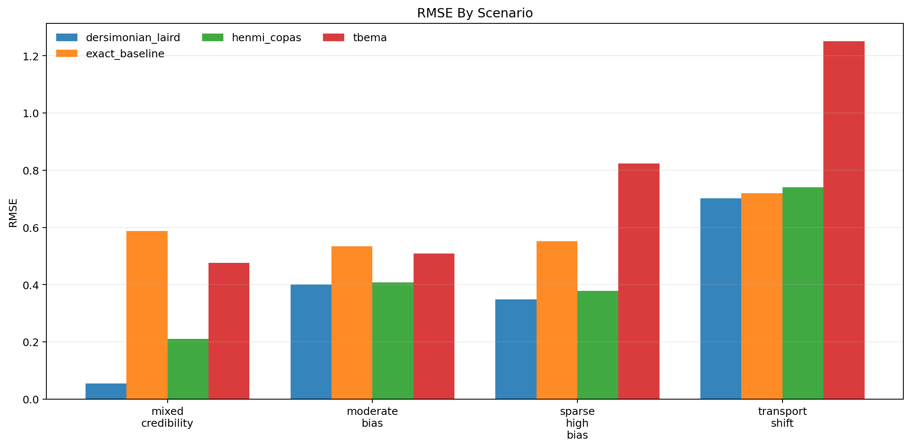
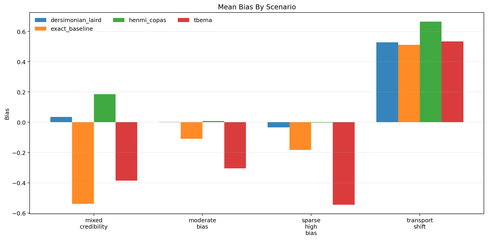
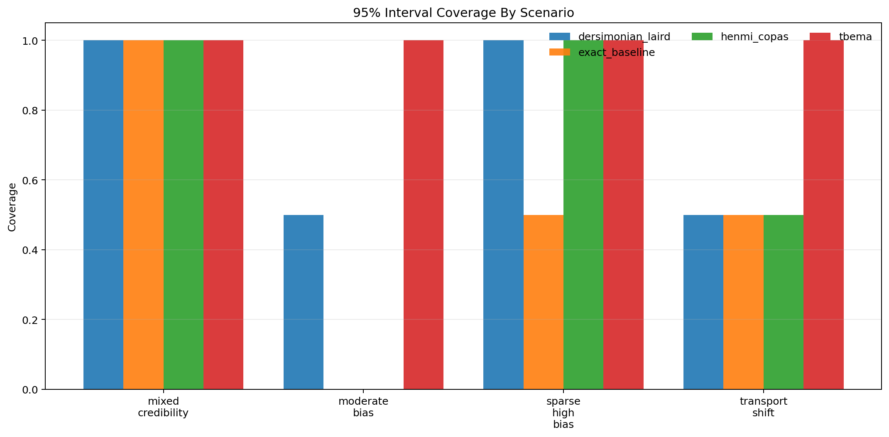
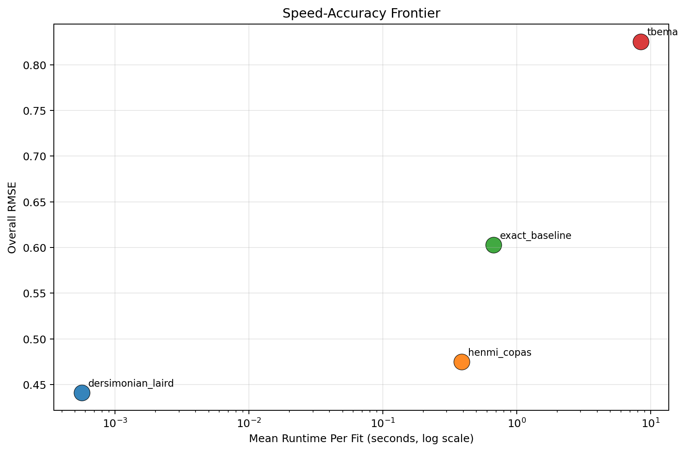

# MetaFrontierLab Benchmark Report

Generated: `2026-04-01T10:53:06.428369+00:00`

## Scope

- Replications per scenario: `2`
- Methods: `tbema, exact_baseline, dersimonian_laird, henmi_copas`
- Scenarios: `4`

## Executive Summary

- Best overall RMSE in this run: `dersimonian_laird` with RMSE `0.441`.
- Fastest method in this run: `dersimonian_laird` at `0.001` seconds per fit on average.
- Interpret these results as engineering benchmarks, not publication-grade evidence, unless you scale the replication count much higher.

## Overall Method Ranking

| method | successful_runs | bias | mean_absolute_error | rmse | coverage_95 | mean_ci_width | mean_elapsed_sec |
| --- | --- | --- | --- | --- | --- | --- | --- |
| dersimonian_laird | 8 | 0.133 | 0.329 | 0.441 | 0.750 | 0.894 | 0.001 |
| henmi_copas | 8 | 0.214 | 0.409 | 0.475 | 0.625 | 1.011 | 0.388 |
| exact_baseline | 8 | -0.080 | 0.524 | 0.603 | 0.500 | 1.017 | 0.671 |
| tbema | 8 | -0.175 | 0.635 | 0.826 | 1.000 | 3.533 | 8.418 |

## Scenario Highlights

- `mixed_credibility`: best RMSE was `dersimonian_laird` (0.055); fastest was `dersimonian_laird` (0.001s); widest intervals came from `tbema` (3.595).
- `moderate_bias`: best RMSE was `dersimonian_laird` (0.401); fastest was `dersimonian_laird` (0.000s); widest intervals came from `tbema` (2.936).
- `sparse_high_bias`: best RMSE was `dersimonian_laird` (0.348); fastest was `dersimonian_laird` (0.001s); widest intervals came from `tbema` (2.880).
- `transport_shift`: best RMSE was `dersimonian_laird` (0.702); fastest was `dersimonian_laird` (0.001s); widest intervals came from `tbema` (4.723).

## Scenario Table

| scenario | method | successful_runs | bias | rmse | coverage_95 | mean_ci_width | mean_elapsed_sec |
| --- | --- | --- | --- | --- | --- | --- | --- |
| mixed_credibility | dersimonian_laird | 2 | 0.036 | 0.055 | 1.000 | 1.069 | 0.001 |
| mixed_credibility | exact_baseline | 2 | -0.539 | 0.588 | 1.000 | 1.515 | 0.670 |
| mixed_credibility | henmi_copas | 2 | 0.185 | 0.211 | 1.000 | 1.329 | 0.452 |
| mixed_credibility | tbema | 2 | -0.386 | 0.477 | 1.000 | 3.595 | 7.952 |
| moderate_bias | dersimonian_laird | 2 | 0.002 | 0.401 | 0.500 | 0.712 | 0.000 |
| moderate_bias | exact_baseline | 2 | -0.108 | 0.534 | 0.000 | 0.743 | 1.220 |
| moderate_bias | henmi_copas | 2 | 0.008 | 0.408 | 0.000 | 0.675 | 0.430 |
| moderate_bias | tbema | 2 | -0.304 | 0.508 | 1.000 | 2.936 | 10.132 |
| sparse_high_bias | dersimonian_laird | 2 | -0.033 | 0.348 | 1.000 | 1.106 | 0.001 |
| sparse_high_bias | exact_baseline | 2 | -0.182 | 0.552 | 0.500 | 1.151 | 0.400 |
| sparse_high_bias | henmi_copas | 2 | -0.002 | 0.379 | 1.000 | 1.188 | 0.331 |
| sparse_high_bias | tbema | 2 | -0.544 | 0.823 | 1.000 | 2.880 | 7.654 |
| transport_shift | dersimonian_laird | 2 | 0.527 | 0.702 | 0.500 | 0.689 | 0.001 |
| transport_shift | exact_baseline | 2 | 0.511 | 0.719 | 0.500 | 0.659 | 0.396 |
| transport_shift | henmi_copas | 2 | 0.664 | 0.740 | 0.500 | 0.850 | 0.336 |
| transport_shift | tbema | 2 | 0.535 | 1.250 | 1.000 | 4.723 | 7.932 |

## Figures

### RMSE

### Bias

### Coverage

### Speed-Accuracy Frontier

## Reproducibility

- Source run table: `results/benchmarks/benchmark_runs.csv`
- Source summary table: `results/benchmarks/benchmark_summary.csv`
- Source metadata: `results/benchmarks/benchmark_metadata.json`
