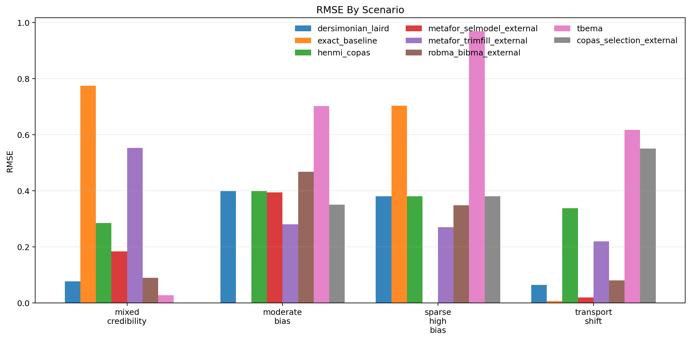
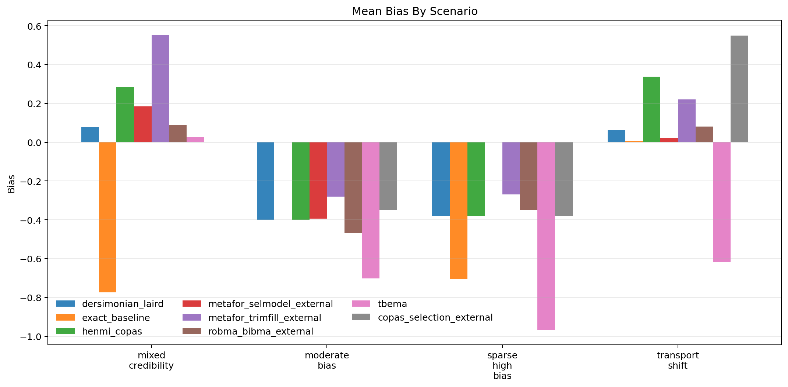
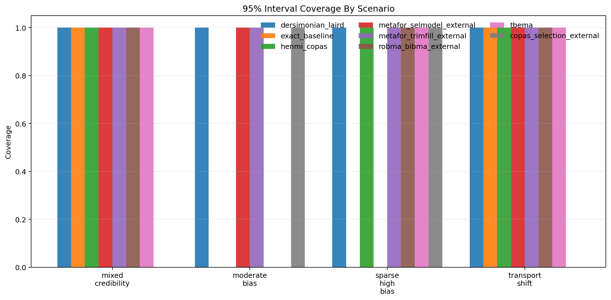
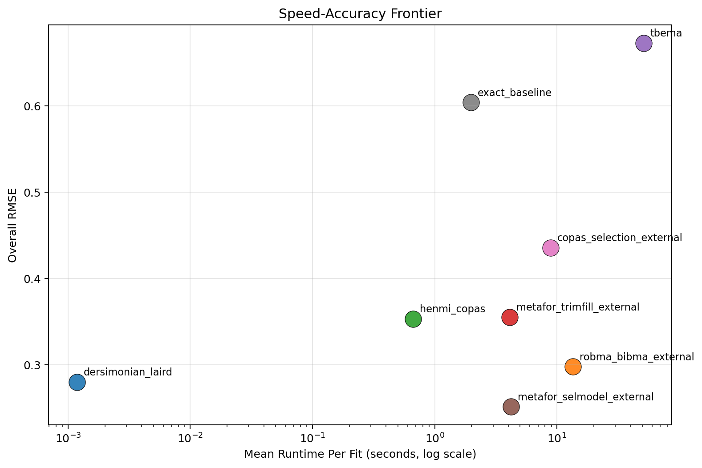

# MetaFrontierLab Benchmark Report

Generated: `2026-04-01T16:50:54.097569+00:00`

## Scope

- Replications per scenario: `1`
- Methods: `tbema, exact_baseline, dersimonian_laird, henmi_copas, metafor_trimfill_external, metafor_selmodel_external, copas_selection_external, robma_bibma_external`
- Scenarios: `4`

## Executive Summary

- Best overall RMSE in this run: `dersimonian_laird` with RMSE `0.280`.
- Fastest method in this run: `dersimonian_laird` at `0.001` seconds per fit on average.
- Highest observed 95% coverage in this run: `dersimonian_laird` at `1.000`.
- Methods with incomplete runs: `metafor_selmodel_external`, `copas_selection_external`, `exact_baseline`.
- Interpret these results as engineering benchmarks, not publication-grade evidence, unless you scale the replication count much higher.
- Runtime numbers for external R methods include adapter startup and package-load overhead, so they are end-to-end benchmark timings rather than pure algorithm cost.

## Overall Method Ranking

| method | attempted_runs | successful_runs | invalid_ok_runs | skipped_runs | error_runs | success_rate | bias | mean_absolute_error | rmse | coverage_95 | mean_ci_width | mean_elapsed_sec |
| --- | --- | --- | --- | --- | --- | --- | --- | --- | --- | --- | --- | --- |
| dersimonian_laird | 4 | 4 | 0 | 0 | 0 | 1.000 | -0.159 | 0.230 | 0.280 | 1.000 | 1.025 | 0.001 |
| robma_bibma_external | 4 | 4 | 0 | 0 | 0 | 1.000 | -0.161 | 0.247 | 0.298 | 0.750 | 0.976 | 13.528 |
| henmi_copas | 4 | 4 | 0 | 0 | 0 | 1.000 | -0.039 | 0.351 | 0.353 | 0.750 | 1.127 | 0.663 |
| metafor_trimfill_external | 4 | 4 | 0 | 0 | 0 | 1.000 | 0.055 | 0.331 | 0.355 | 1.000 | 1.039 | 4.119 |
| tbema | 4 | 4 | 0 | 0 | 0 | 1.000 | -0.565 | 0.579 | 0.673 | 0.750 | 1.648 | 51.114 |
| metafor_selmodel_external | 4 | 3 | 0 | 0 | 1 | 0.750 | -0.064 | 0.199 | 0.251 | 1.000 | 1.084 | 4.229 |
| copas_selection_external | 4 | 3 | 0 | 0 | 1 | 0.750 | -0.060 | 0.427 | 0.436 | 0.667 | 1.020 | 8.901 |
| exact_baseline | 4 | 3 | 0 | 0 | 1 | 0.750 | -0.490 | 0.495 | 0.604 | 0.667 | 1.392 | 1.977 |

## Scenario Highlights

- `mixed_credibility`: best RMSE was `tbema` (0.028); fastest was `dersimonian_laird` (0.000s); widest intervals came from `exact_baseline` (1.988). Incomplete runs: `copas_selection_external`.
- `moderate_bias`: best RMSE was `metafor_trimfill_external` (0.281); fastest was `dersimonian_laird` (0.002s); widest intervals came from `tbema` (1.266). Incomplete runs: `exact_baseline`.
- `sparse_high_bias`: best RMSE was `metafor_trimfill_external` (0.270); fastest was `dersimonian_laird` (0.002s); widest intervals came from `tbema` (2.211). Incomplete runs: `metafor_selmodel_external`.
- `transport_shift`: best RMSE was `exact_baseline` (0.006); fastest was `dersimonian_laird` (0.001s); widest intervals came from `tbema` (1.977).

## Scenario Table

| scenario | method | replications_total | successful_runs | invalid_ok_runs | skipped_runs | error_runs | success_rate | bias | rmse | coverage_95 | mean_ci_width | mean_elapsed_sec |
| --- | --- | --- | --- | --- | --- | --- | --- | --- | --- | --- | --- | --- |
| mixed_credibility | copas_selection_external | 1 | 0 | 0 | 0 | 1 | 0.000 | NA | NA | NA | NA | 8.492 |
| mixed_credibility | dersimonian_laird | 1 | 1 | 0 | 0 | 0 | 1.000 | 0.077 | 0.077 | 1.000 | 1.135 | 0.000 |
| mixed_credibility | exact_baseline | 1 | 1 | 0 | 0 | 0 | 1.000 | -0.774 | 0.774 | 1.000 | 1.988 | 2.271 |
| mixed_credibility | henmi_copas | 1 | 1 | 0 | 0 | 0 | 1.000 | 0.285 | 0.285 | 1.000 | 1.329 | 0.520 |
| mixed_credibility | metafor_selmodel_external | 1 | 1 | 0 | 0 | 0 | 1.000 | 0.184 | 0.184 | 1.000 | 1.377 | 3.608 |
| mixed_credibility | metafor_trimfill_external | 1 | 1 | 0 | 0 | 0 | 1.000 | 0.553 | 0.553 | 1.000 | 1.238 | 3.328 |
| mixed_credibility | robma_bibma_external | 1 | 1 | 0 | 0 | 0 | 1.000 | 0.090 | 0.090 | 1.000 | 1.077 | 12.694 |
| mixed_credibility | tbema | 1 | 1 | 0 | 0 | 0 | 1.000 | 0.028 | 0.028 | 1.000 | 1.137 | 54.279 |
| moderate_bias | copas_selection_external | 1 | 1 | 0 | 0 | 0 | 1.000 | -0.350 | 0.350 | 1.000 | 0.845 | 9.506 |
| moderate_bias | dersimonian_laird | 1 | 1 | 0 | 0 | 0 | 1.000 | -0.399 | 0.399 | 1.000 | 0.824 | 0.002 |
| moderate_bias | exact_baseline | 1 | 0 | 0 | 0 | 1 | 0.000 | NA | NA | NA | NA | 1.171 |
| moderate_bias | henmi_copas | 1 | 1 | 0 | 0 | 0 | 1.000 | -0.399 | 0.399 | 0.000 | 0.765 | 0.632 |
| moderate_bias | metafor_selmodel_external | 1 | 1 | 0 | 0 | 0 | 1.000 | -0.394 | 0.394 | 1.000 | 0.829 | 4.564 |
| moderate_bias | metafor_trimfill_external | 1 | 1 | 0 | 0 | 0 | 1.000 | -0.281 | 0.281 | 1.000 | 0.839 | 4.306 |
| moderate_bias | robma_bibma_external | 1 | 1 | 0 | 0 | 0 | 1.000 | -0.468 | 0.468 | 0.000 | 0.837 | 14.144 |
| moderate_bias | tbema | 1 | 1 | 0 | 0 | 0 | 1.000 | -0.702 | 0.702 | 0.000 | 1.266 | 42.459 |
| sparse_high_bias | copas_selection_external | 1 | 1 | 0 | 0 | 0 | 1.000 | -0.380 | 0.380 | 1.000 | 1.148 | 8.413 |
| sparse_high_bias | dersimonian_laird | 1 | 1 | 0 | 0 | 0 | 1.000 | -0.380 | 0.380 | 1.000 | 1.148 | 0.002 |
| sparse_high_bias | exact_baseline | 1 | 1 | 0 | 0 | 0 | 1.000 | -0.704 | 0.704 | 0.000 | 1.269 | 1.406 |
| sparse_high_bias | henmi_copas | 1 | 1 | 0 | 0 | 0 | 1.000 | -0.380 | 0.380 | 1.000 | 1.076 | 0.562 |
| sparse_high_bias | metafor_selmodel_external | 1 | 0 | 0 | 0 | 1 | 0.000 | NA | NA | NA | NA | 4.607 |
| sparse_high_bias | metafor_trimfill_external | 1 | 1 | 0 | 0 | 0 | 1.000 | -0.270 | 0.270 | 1.000 | 1.108 | 4.188 |
| sparse_high_bias | robma_bibma_external | 1 | 1 | 0 | 0 | 0 | 1.000 | -0.348 | 0.348 | 1.000 | 1.066 | 14.268 |
| sparse_high_bias | tbema | 1 | 1 | 0 | 0 | 0 | 1.000 | -0.968 | 0.968 | 1.000 | 2.211 | 50.993 |
| transport_shift | copas_selection_external | 1 | 1 | 0 | 0 | 0 | 1.000 | 0.550 | 0.550 | 0.000 | 1.068 | 9.193 |
| transport_shift | dersimonian_laird | 1 | 1 | 0 | 0 | 0 | 1.000 | 0.064 | 0.064 | 1.000 | 0.993 | 0.001 |
| transport_shift | exact_baseline | 1 | 1 | 0 | 0 | 0 | 1.000 | 0.006 | 0.006 | 1.000 | 0.918 | 3.061 |
| transport_shift | henmi_copas | 1 | 1 | 0 | 0 | 0 | 1.000 | 0.338 | 0.338 | 1.000 | 1.339 | 0.938 |
| transport_shift | metafor_selmodel_external | 1 | 1 | 0 | 0 | 0 | 1.000 | 0.019 | 0.019 | 1.000 | 1.045 | 4.136 |
| transport_shift | metafor_trimfill_external | 1 | 1 | 0 | 0 | 0 | 1.000 | 0.220 | 0.220 | 1.000 | 0.971 | 4.653 |
| transport_shift | robma_bibma_external | 1 | 1 | 0 | 0 | 0 | 1.000 | 0.081 | 0.081 | 1.000 | 0.923 | 13.006 |
| transport_shift | tbema | 1 | 1 | 0 | 0 | 0 | 1.000 | -0.616 | 0.616 | 1.000 | 1.977 | 56.725 |

## Figures

### RMSE

### Bias

### Coverage

### Speed-Accuracy Frontier

## Reproducibility

- Source run table: `results/benchmarks_fixed_smoke/benchmark_runs.csv`
- Source summary table: `results/benchmarks_fixed_smoke/benchmark_summary.csv`
- Source metadata: `results/benchmarks_fixed_smoke/benchmark_metadata.json`
