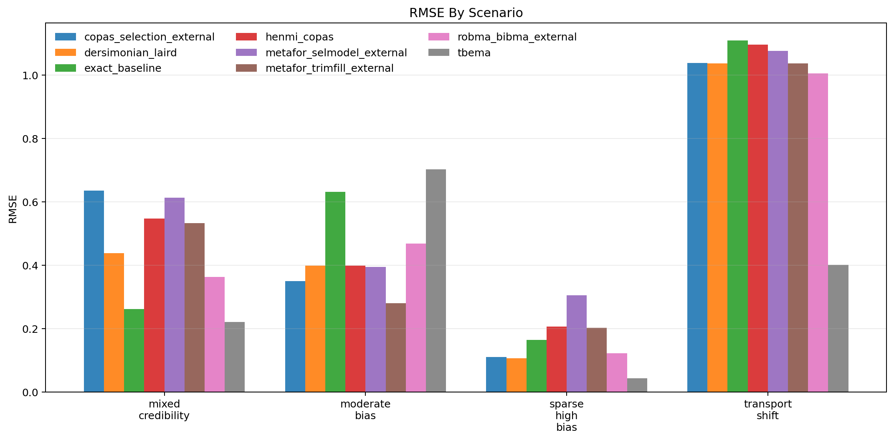
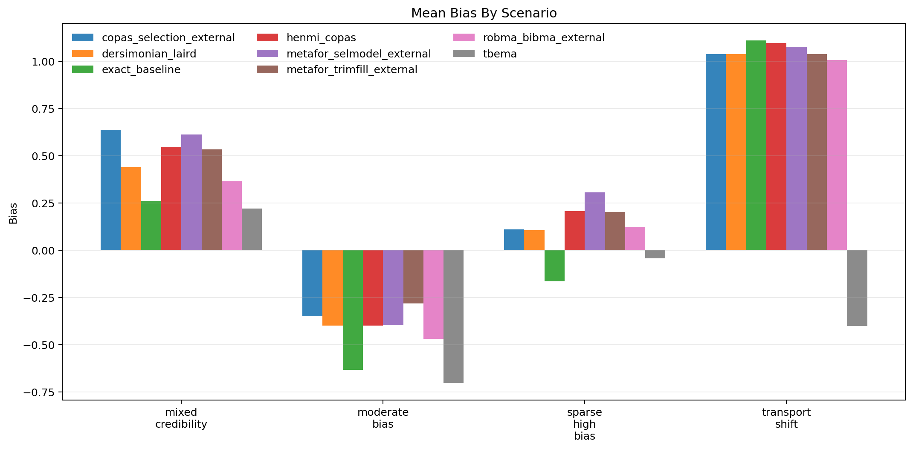
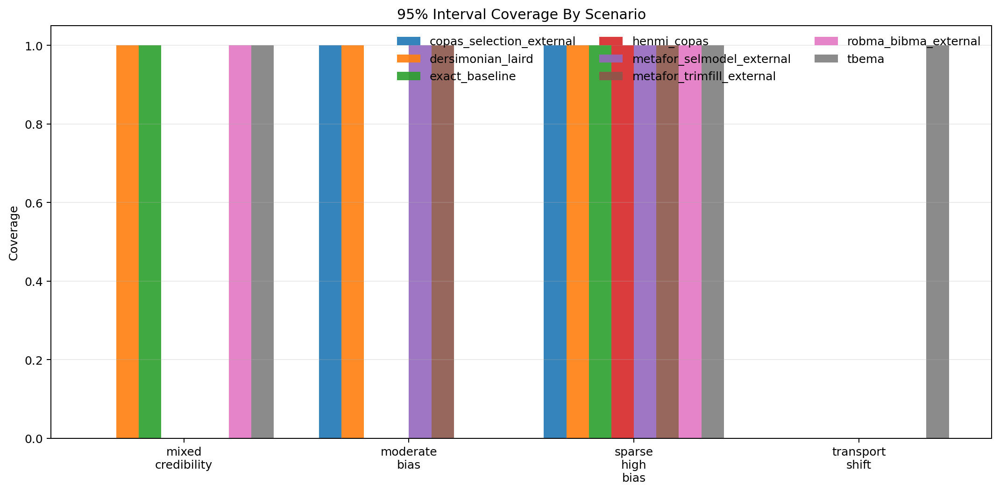
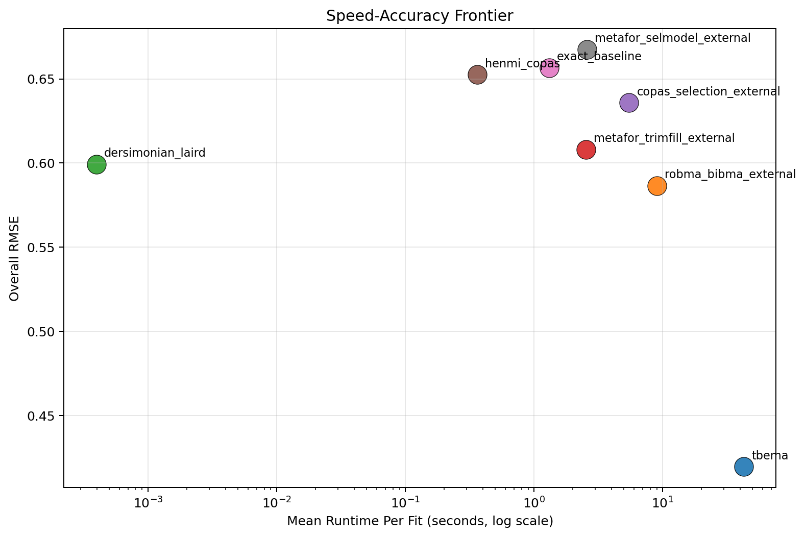

# MetaFrontierLab Benchmark Report

Generated: `2026-04-01T17:58:07.204803+00:00`

## Scope

- Replications per scenario: `1`
- Methods: `tbema, exact_baseline, dersimonian_laird, henmi_copas, metafor_trimfill_external, metafor_selmodel_external, copas_selection_external, robma_bibma_external`
- Scenarios: `4`

## Executive Summary

- Best overall RMSE in this run: `tbema` with RMSE `0.420`.
- Fastest method in this run: `dersimonian_laird` at `0.000` seconds per fit on average.
- Highest observed 95% coverage in this run: `tbema` at `0.750`.
- Interpret these results as engineering benchmarks, not publication-grade evidence, unless you scale the replication count much higher.
- `mean_elapsed_sec` summarizes valid completed fits only; `mean_elapsed_sec_attempted` includes failures and adapter startup overhead.

## Overall Method Ranking

| method | attempted_runs | successful_runs | invalid_ok_runs | skipped_runs | error_runs | success_rate | bias | mean_absolute_error | rmse | coverage_95 | mean_ci_width | mean_elapsed_sec | mean_elapsed_sec_attempted |
| --- | --- | --- | --- | --- | --- | --- | --- | --- | --- | --- | --- | --- | --- |
| tbema | 4 | 4 | 0 | 0 | 0 | 1.000 | -0.231 | 0.342 | 0.420 | 0.750 | 1.421 | 42.637 | 42.637 |
| robma_bibma_external | 4 | 4 | 0 | 0 | 0 | 1.000 | 0.256 | 0.490 | 0.587 | 0.500 | 0.830 | 9.006 | 9.006 |
| dersimonian_laird | 4 | 4 | 0 | 0 | 0 | 1.000 | 0.295 | 0.495 | 0.599 | 0.750 | 0.886 | 0.000 | 0.000 |
| metafor_trimfill_external | 4 | 4 | 0 | 0 | 0 | 1.000 | 0.373 | 0.513 | 0.608 | 0.500 | 0.900 | 2.535 | 2.535 |
| copas_selection_external | 4 | 4 | 0 | 0 | 0 | 1.000 | 0.358 | 0.534 | 0.636 | 0.500 | 0.826 | 5.478 | 5.478 |
| henmi_copas | 4 | 4 | 0 | 0 | 0 | 1.000 | 0.363 | 0.562 | 0.652 | 0.250 | 1.008 | 0.362 | 0.362 |
| exact_baseline | 4 | 4 | 0 | 0 | 0 | 1.000 | 0.143 | 0.542 | 0.657 | 0.500 | 1.083 | 1.316 | 1.316 |
| metafor_selmodel_external | 4 | 4 | 0 | 0 | 0 | 1.000 | 0.400 | 0.597 | 0.668 | 0.500 | 1.146 | 2.588 | 2.588 |

## Scenario Highlights

- `mixed_credibility`: best RMSE was `tbema` (0.221); fastest was `dersimonian_laird` (0.000s); widest intervals came from `exact_baseline` (1.243).
- `moderate_bias`: best RMSE was `metafor_trimfill_external` (0.281); fastest was `dersimonian_laird` (0.000s); widest intervals came from `tbema` (1.254).
- `sparse_high_bias`: best RMSE was `tbema` (0.043); fastest was `dersimonian_laird` (0.000s); widest intervals came from `metafor_selmodel_external` (1.692).
- `transport_shift`: best RMSE was `tbema` (0.401); fastest was `dersimonian_laird` (0.000s); widest intervals came from `tbema` (1.940).

## Scenario Table

| scenario | method | replications_total | successful_runs | invalid_ok_runs | skipped_runs | error_runs | success_rate | bias | rmse | coverage_95 | mean_ci_width | mean_elapsed_sec | mean_elapsed_sec_attempted |
| --- | --- | --- | --- | --- | --- | --- | --- | --- | --- | --- | --- | --- | --- |
| mixed_credibility | copas_selection_external | 1 | 1 | 0 | 0 | 0 | 1.000 | 0.636 | 0.636 | 0.000 | 0.702 | 4.227 | 4.227 |
| mixed_credibility | dersimonian_laird | 1 | 1 | 0 | 0 | 0 | 1.000 | 0.438 | 0.438 | 1.000 | 0.924 | 0.000 | 0.000 |
| mixed_credibility | exact_baseline | 1 | 1 | 0 | 0 | 0 | 1.000 | 0.262 | 0.262 | 1.000 | 1.243 | 1.117 | 1.117 |
| mixed_credibility | henmi_copas | 1 | 1 | 0 | 0 | 0 | 1.000 | 0.548 | 0.548 | 0.000 | 1.049 | 0.310 | 0.310 |
| mixed_credibility | metafor_selmodel_external | 1 | 1 | 0 | 0 | 0 | 1.000 | 0.613 | 0.613 | 0.000 | 1.068 | 1.817 | 1.817 |
| mixed_credibility | metafor_trimfill_external | 1 | 1 | 0 | 0 | 0 | 1.000 | 0.533 | 0.533 | 0.000 | 0.980 | 1.757 | 1.757 |
| mixed_credibility | robma_bibma_external | 1 | 1 | 0 | 0 | 0 | 1.000 | 0.364 | 0.364 | 1.000 | 0.817 | 7.163 | 7.163 |
| mixed_credibility | tbema | 1 | 1 | 0 | 0 | 0 | 1.000 | 0.221 | 0.221 | 1.000 | 0.949 | 29.901 | 29.901 |
| moderate_bias | copas_selection_external | 1 | 1 | 0 | 0 | 0 | 1.000 | -0.350 | 0.350 | 1.000 | 0.845 | 7.483 | 7.483 |
| moderate_bias | dersimonian_laird | 1 | 1 | 0 | 0 | 0 | 1.000 | -0.399 | 0.399 | 1.000 | 0.824 | 0.000 | 0.000 |
| moderate_bias | exact_baseline | 1 | 1 | 0 | 0 | 0 | 1.000 | -0.632 | 0.632 | 0.000 | 1.115 | 1.774 | 1.774 |
| moderate_bias | henmi_copas | 1 | 1 | 0 | 0 | 0 | 1.000 | -0.399 | 0.399 | 0.000 | 0.765 | 0.491 | 0.491 |
| moderate_bias | metafor_selmodel_external | 1 | 1 | 0 | 0 | 0 | 1.000 | -0.394 | 0.394 | 1.000 | 0.829 | 3.695 | 3.695 |
| moderate_bias | metafor_trimfill_external | 1 | 1 | 0 | 0 | 0 | 1.000 | -0.281 | 0.281 | 1.000 | 0.839 | 3.667 | 3.667 |
| moderate_bias | robma_bibma_external | 1 | 1 | 0 | 0 | 0 | 1.000 | -0.468 | 0.468 | 0.000 | 0.837 | 12.423 | 12.423 |
| moderate_bias | tbema | 1 | 1 | 0 | 0 | 0 | 1.000 | -0.702 | 0.702 | 0.000 | 1.254 | 46.308 | 46.308 |
| sparse_high_bias | copas_selection_external | 1 | 1 | 0 | 0 | 0 | 1.000 | 0.110 | 0.110 | 1.000 | 1.131 | 5.748 | 5.748 |
| sparse_high_bias | dersimonian_laird | 1 | 1 | 0 | 0 | 0 | 1.000 | 0.106 | 0.106 | 1.000 | 1.161 | 0.000 | 0.000 |
| sparse_high_bias | exact_baseline | 1 | 1 | 0 | 0 | 0 | 1.000 | -0.165 | 0.165 | 1.000 | 1.461 | 1.410 | 1.410 |
| sparse_high_bias | henmi_copas | 1 | 1 | 0 | 0 | 0 | 1.000 | 0.206 | 0.206 | 1.000 | 1.450 | 0.380 | 0.380 |
| sparse_high_bias | metafor_selmodel_external | 1 | 1 | 0 | 0 | 0 | 1.000 | 0.305 | 0.305 | 1.000 | 1.692 | 2.884 | 2.884 |
| sparse_high_bias | metafor_trimfill_external | 1 | 1 | 0 | 0 | 0 | 1.000 | 0.203 | 0.203 | 1.000 | 1.144 | 2.730 | 2.730 |
| sparse_high_bias | robma_bibma_external | 1 | 1 | 0 | 0 | 0 | 1.000 | 0.123 | 0.123 | 1.000 | 0.990 | 7.764 | 7.764 |
| sparse_high_bias | tbema | 1 | 1 | 0 | 0 | 0 | 1.000 | -0.043 | 0.043 | 1.000 | 1.543 | 45.273 | 45.273 |
| transport_shift | copas_selection_external | 1 | 1 | 0 | 0 | 0 | 1.000 | 1.038 | 1.038 | 0.000 | 0.628 | 4.457 | 4.457 |
| transport_shift | dersimonian_laird | 1 | 1 | 0 | 0 | 0 | 1.000 | 1.036 | 1.036 | 0.000 | 0.636 | 0.000 | 0.000 |
| transport_shift | exact_baseline | 1 | 1 | 0 | 0 | 0 | 1.000 | 1.109 | 1.109 | 0.000 | 0.515 | 0.964 | 0.964 |
| transport_shift | henmi_copas | 1 | 1 | 0 | 0 | 0 | 1.000 | 1.096 | 1.096 | 0.000 | 0.768 | 0.266 | 0.266 |
| transport_shift | metafor_selmodel_external | 1 | 1 | 0 | 0 | 0 | 1.000 | 1.076 | 1.076 | 0.000 | 0.997 | 1.955 | 1.955 |
| transport_shift | metafor_trimfill_external | 1 | 1 | 0 | 0 | 0 | 1.000 | 1.036 | 1.036 | 0.000 | 0.636 | 1.988 | 1.988 |
| transport_shift | robma_bibma_external | 1 | 1 | 0 | 0 | 0 | 1.000 | 1.005 | 1.005 | 0.000 | 0.678 | 8.675 | 8.675 |
| transport_shift | tbema | 1 | 1 | 0 | 0 | 0 | 1.000 | -0.401 | 0.401 | 1.000 | 1.940 | 49.065 | 49.065 |

## Figures

### RMSE

### Bias

### Coverage

### Speed-Accuracy Frontier

## Reproducibility

- Source run table: `results/benchmarks_math_upgrade_smoke/benchmark_runs.csv`
- Source summary table: `results/benchmarks_math_upgrade_smoke/benchmark_summary.csv`
- Source metadata: `results/benchmarks_math_upgrade_smoke/benchmark_metadata.json`
