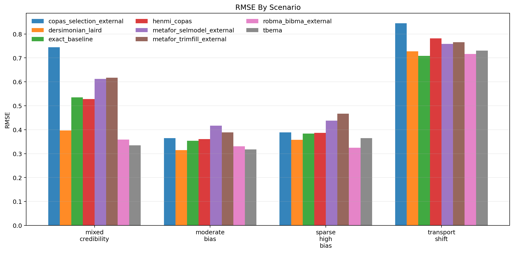
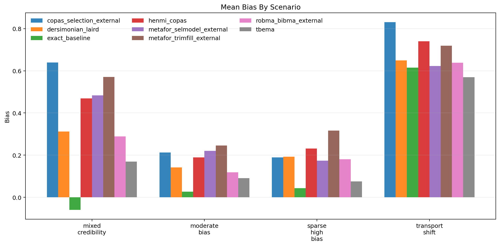
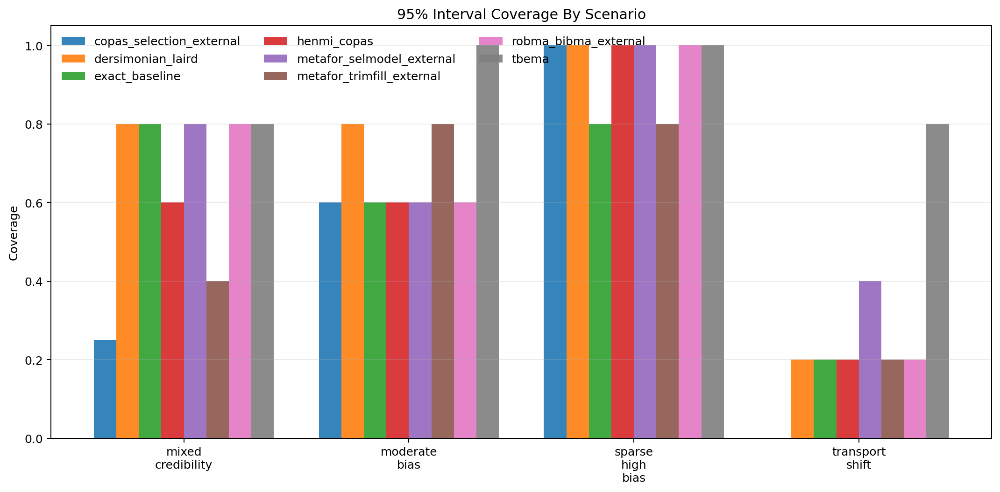
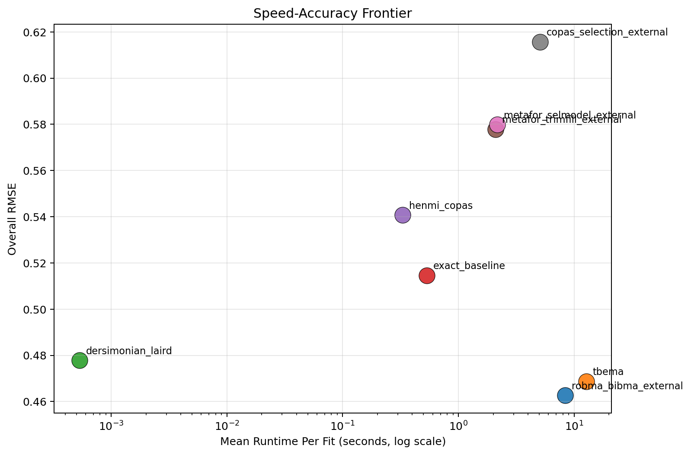

# MetaFrontierLab Benchmark Report

Generated: `2026-04-01T11:48:39.633744+00:00`

## Scope

- Replications per scenario: `5`
- Methods: `tbema, exact_baseline, dersimonian_laird, henmi_copas, metafor_trimfill_external, metafor_selmodel_external, copas_selection_external, robma_bibma_external`
- Scenarios: `4`

## Executive Summary

- Best overall RMSE in this run: `robma_bibma_external` with RMSE `0.463`.
- Fastest method in this run: `dersimonian_laird` at `0.001` seconds per fit on average.
- Interpret these results as engineering benchmarks, not publication-grade evidence, unless you scale the replication count much higher.

## Overall Method Ranking

| method | successful_runs | bias | mean_absolute_error | rmse | coverage_95 | mean_ci_width | mean_elapsed_sec |
| --- | --- | --- | --- | --- | --- | --- | --- |
| robma_bibma_external | 20 | 0.306 | 0.388 | 0.463 | 0.650 | 0.819 | 8.408 |
| tbema | 20 | 0.226 | 0.376 | 0.469 | 0.900 | 3.209 | 12.736 |
| dersimonian_laird | 20 | 0.324 | 0.402 | 0.478 | 0.700 | 0.876 | 0.001 |
| exact_baseline | 20 | 0.156 | 0.431 | 0.515 | 0.600 | 1.223 | 0.532 |
| henmi_copas | 20 | 0.407 | 0.485 | 0.541 | 0.600 | 0.983 | 0.330 |
| metafor_trimfill_external | 20 | 0.463 | 0.526 | 0.578 | 0.550 | 0.964 | 2.102 |
| metafor_selmodel_external | 19 | 0.386 | 0.484 | 0.580 | 0.684 | 1.210 | 2.174 |
| copas_selection_external | 19 | 0.459 | 0.546 | 0.616 | 0.474 | 0.877 | 5.081 |

## Scenario Highlights

- `mixed_credibility`: best RMSE was `tbema` (0.334); fastest was `dersimonian_laird` (0.001s); widest intervals came from `tbema` (2.627).
- `moderate_bias`: best RMSE was `dersimonian_laird` (0.314); fastest was `dersimonian_laird` (0.000s); widest intervals came from `tbema` (1.164).
- `sparse_high_bias`: best RMSE was `robma_bibma_external` (0.324); fastest was `dersimonian_laird` (0.001s); widest intervals came from `tbema` (2.591).
- `transport_shift`: best RMSE was `exact_baseline` (0.708); fastest was `dersimonian_laird` (0.001s); widest intervals came from `tbema` (6.453).

## Scenario Table

| scenario | method | successful_runs | bias | rmse | coverage_95 | mean_ci_width | mean_elapsed_sec |
| --- | --- | --- | --- | --- | --- | --- | --- |
| mixed_credibility | copas_selection_external | 4 | 0.640 | 0.745 | 0.250 | 1.054 | 5.466 |
| mixed_credibility | dersimonian_laird | 5 | 0.312 | 0.396 | 0.800 | 0.996 | 0.001 |
| mixed_credibility | exact_baseline | 5 | -0.059 | 0.535 | 0.800 | 1.959 | 0.633 |
| mixed_credibility | henmi_copas | 5 | 0.469 | 0.528 | 0.600 | 1.205 | 0.400 |
| mixed_credibility | metafor_selmodel_external | 5 | 0.484 | 0.613 | 0.800 | 1.566 | 2.383 |
| mixed_credibility | metafor_trimfill_external | 5 | 0.571 | 0.617 | 0.400 | 1.113 | 2.308 |
| mixed_credibility | robma_bibma_external | 5 | 0.289 | 0.358 | 0.800 | 0.939 | 8.584 |
| mixed_credibility | tbema | 5 | 0.170 | 0.334 | 0.800 | 2.627 | 11.680 |
| moderate_bias | copas_selection_external | 5 | 0.213 | 0.365 | 0.600 | 0.751 | 4.829 |
| moderate_bias | dersimonian_laird | 5 | 0.141 | 0.314 | 0.800 | 0.779 | 0.000 |
| moderate_bias | exact_baseline | 5 | 0.027 | 0.353 | 0.600 | 0.927 | 0.592 |
| moderate_bias | henmi_copas | 5 | 0.189 | 0.361 | 0.600 | 0.822 | 0.299 |
| moderate_bias | metafor_selmodel_external | 5 | 0.220 | 0.417 | 0.600 | 1.080 | 2.094 |
| moderate_bias | metafor_trimfill_external | 5 | 0.246 | 0.389 | 0.800 | 0.859 | 2.045 |
| moderate_bias | robma_bibma_external | 5 | 0.119 | 0.330 | 0.600 | 0.732 | 8.383 |
| moderate_bias | tbema | 5 | 0.091 | 0.317 | 1.000 | 1.164 | 11.910 |
| sparse_high_bias | copas_selection_external | 5 | 0.189 | 0.389 | 1.000 | 1.075 | 4.923 |
| sparse_high_bias | dersimonian_laird | 5 | 0.192 | 0.358 | 1.000 | 1.054 | 0.001 |
| sparse_high_bias | exact_baseline | 5 | 0.043 | 0.383 | 0.800 | 1.244 | 0.458 |
| sparse_high_bias | henmi_copas | 5 | 0.231 | 0.387 | 1.000 | 1.094 | 0.309 |
| sparse_high_bias | metafor_selmodel_external | 4 | 0.174 | 0.438 | 1.000 | 1.198 | 2.087 |
| sparse_high_bias | metafor_trimfill_external | 5 | 0.316 | 0.466 | 0.800 | 1.164 | 2.086 |
| sparse_high_bias | robma_bibma_external | 5 | 0.180 | 0.324 | 1.000 | 0.925 | 8.332 |
| sparse_high_bias | tbema | 5 | 0.075 | 0.364 | 1.000 | 2.591 | 14.072 |
| transport_shift | copas_selection_external | 5 | 0.830 | 0.844 | 0.000 | 0.663 | 5.098 |
| transport_shift | dersimonian_laird | 5 | 0.649 | 0.728 | 0.200 | 0.674 | 0.001 |
| transport_shift | exact_baseline | 5 | 0.615 | 0.708 | 0.200 | 0.760 | 0.445 |
| transport_shift | henmi_copas | 5 | 0.740 | 0.781 | 0.200 | 0.811 | 0.311 |
| transport_shift | metafor_selmodel_external | 5 | 0.623 | 0.758 | 0.400 | 0.994 | 2.115 |
| transport_shift | metafor_trimfill_external | 5 | 0.719 | 0.766 | 0.200 | 0.719 | 1.969 |
| transport_shift | robma_bibma_external | 5 | 0.638 | 0.717 | 0.200 | 0.681 | 8.334 |
| transport_shift | tbema | 5 | 0.570 | 0.731 | 0.800 | 6.453 | 13.283 |

## Figures

### RMSE

### Bias

### Coverage

### Speed-Accuracy Frontier

## Reproducibility

- Source run table: `results/benchmarks_scaled_full/benchmark_runs.csv`
- Source summary table: `results/benchmarks_scaled_full/benchmark_summary.csv`
- Source metadata: `results/benchmarks_scaled_full/benchmark_metadata.json`
