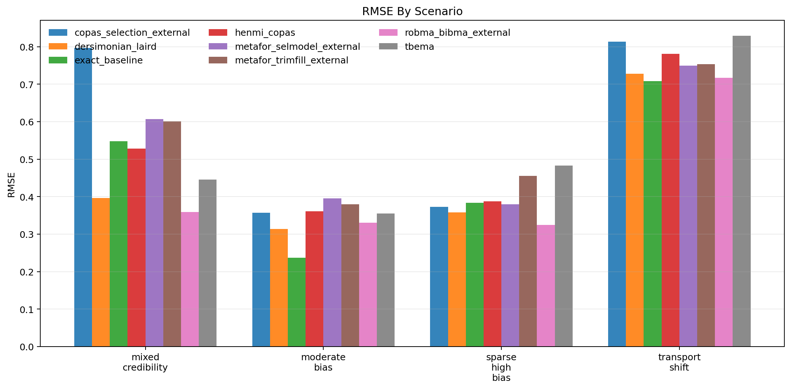
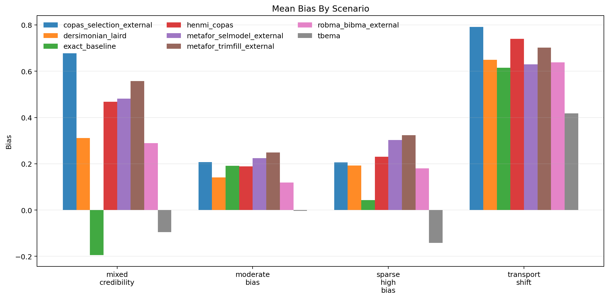
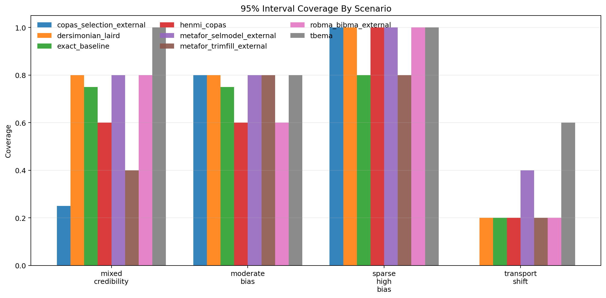
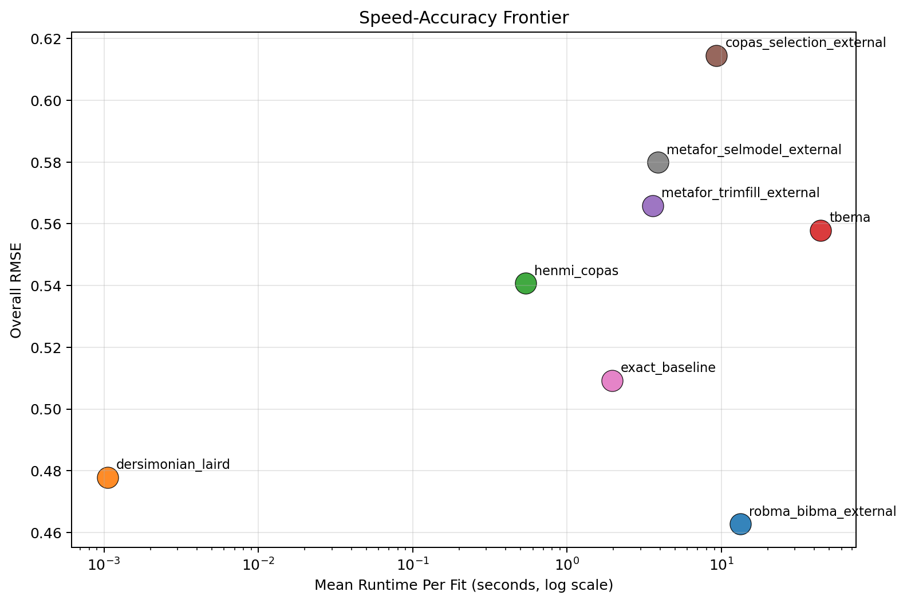

# MetaFrontierLab Benchmark Report

Generated: `2026-04-01T17:30:33.059915+00:00`

## Scope

- Replications per scenario: `5`
- Methods: `tbema, exact_baseline, dersimonian_laird, henmi_copas, metafor_trimfill_external, metafor_selmodel_external, copas_selection_external, robma_bibma_external`
- Scenarios: `4`

## Executive Summary

- Best overall RMSE in this run: `robma_bibma_external` with RMSE `0.463`.
- Fastest method in this run: `dersimonian_laird` at `0.001` seconds per fit on average.
- Highest observed 95% coverage in this run: `tbema` at `0.850`.
- Methods with incomplete runs: `copas_selection_external`, `exact_baseline`, `metafor_selmodel_external`.
- Interpret these results as engineering benchmarks, not publication-grade evidence, unless you scale the replication count much higher.
- Runtime numbers for external R methods include adapter startup and package-load overhead, so they are end-to-end benchmark timings rather than pure algorithm cost.

## Overall Method Ranking

| method | attempted_runs | successful_runs | invalid_ok_runs | skipped_runs | error_runs | success_rate | bias | mean_absolute_error | rmse | coverage_95 | mean_ci_width | mean_elapsed_sec |
| --- | --- | --- | --- | --- | --- | --- | --- | --- | --- | --- | --- | --- |
| robma_bibma_external | 20 | 20 | 0 | 0 | 0 | 1.000 | 0.306 | 0.388 | 0.463 | 0.650 | 0.819 | 13.319 |
| dersimonian_laird | 20 | 20 | 0 | 0 | 0 | 1.000 | 0.324 | 0.402 | 0.478 | 0.700 | 0.876 | 0.001 |
| henmi_copas | 20 | 20 | 0 | 0 | 0 | 1.000 | 0.407 | 0.485 | 0.541 | 0.600 | 0.983 | 0.540 |
| tbema | 20 | 20 | 0 | 0 | 0 | 1.000 | 0.044 | 0.421 | 0.558 | 0.850 | 1.619 | 43.893 |
| metafor_trimfill_external | 20 | 20 | 0 | 0 | 0 | 1.000 | 0.458 | 0.513 | 0.566 | 0.550 | 0.902 | 3.588 |
| copas_selection_external | 20 | 19 | 0 | 0 | 1 | 0.950 | 0.460 | 0.536 | 0.615 | 0.526 | 0.843 | 9.300 |
| exact_baseline | 20 | 18 | 0 | 0 | 2 | 0.900 | 0.182 | 0.417 | 0.509 | 0.611 | 1.105 | 1.958 |
| metafor_selmodel_external | 20 | 17 | 0 | 0 | 3 | 0.850 | 0.429 | 0.475 | 0.580 | 0.706 | 1.125 | 3.886 |

## Scenario Highlights

- `mixed_credibility`: best RMSE was `robma_bibma_external` (0.358); fastest was `dersimonian_laird` (0.001s); widest intervals came from `exact_baseline` (1.474). Incomplete runs: `copas_selection_external`, `exact_baseline`.
- `moderate_bias`: best RMSE was `dersimonian_laird` (0.314); fastest was `dersimonian_laird` (0.002s); widest intervals came from `tbema` (1.154). Incomplete runs: `exact_baseline`.
- `sparse_high_bias`: best RMSE was `robma_bibma_external` (0.324); fastest was `dersimonian_laird` (0.001s); widest intervals came from `tbema` (1.798). Incomplete runs: `metafor_selmodel_external`.
- `transport_shift`: best RMSE was `exact_baseline` (0.708); fastest was `dersimonian_laird` (0.001s); widest intervals came from `tbema` (2.070).

## Scenario Table

| scenario | method | replications_total | successful_runs | invalid_ok_runs | skipped_runs | error_runs | success_rate | bias | rmse | coverage_95 | mean_ci_width | mean_elapsed_sec |
| --- | --- | --- | --- | --- | --- | --- | --- | --- | --- | --- | --- | --- |
| mixed_credibility | copas_selection_external | 5 | 4 | 0 | 0 | 1 | 0.800 | 0.678 | 0.797 | 0.250 | 0.928 | 8.600 |
| mixed_credibility | dersimonian_laird | 5 | 5 | 0 | 0 | 0 | 1.000 | 0.312 | 0.396 | 0.800 | 0.996 | 0.001 |
| mixed_credibility | exact_baseline | 5 | 4 | 0 | 0 | 1 | 0.800 | -0.194 | 0.548 | 0.750 | 1.474 | 1.923 |
| mixed_credibility | henmi_copas | 5 | 5 | 0 | 0 | 0 | 1.000 | 0.469 | 0.528 | 0.600 | 1.205 | 0.508 |
| mixed_credibility | metafor_selmodel_external | 5 | 5 | 0 | 0 | 0 | 1.000 | 0.482 | 0.607 | 0.800 | 1.459 | 3.779 |
| mixed_credibility | metafor_trimfill_external | 5 | 5 | 0 | 0 | 0 | 1.000 | 0.557 | 0.601 | 0.400 | 1.038 | 3.397 |
| mixed_credibility | robma_bibma_external | 5 | 5 | 0 | 0 | 0 | 1.000 | 0.289 | 0.358 | 0.800 | 0.939 | 11.695 |
| mixed_credibility | tbema | 5 | 5 | 0 | 0 | 0 | 1.000 | -0.095 | 0.446 | 1.000 | 1.453 | 36.919 |
| moderate_bias | copas_selection_external | 5 | 5 | 0 | 0 | 0 | 1.000 | 0.208 | 0.357 | 0.800 | 0.805 | 9.447 |
| moderate_bias | dersimonian_laird | 5 | 5 | 0 | 0 | 0 | 1.000 | 0.141 | 0.314 | 0.800 | 0.779 | 0.002 |
| moderate_bias | exact_baseline | 5 | 4 | 0 | 0 | 1 | 0.800 | 0.191 | 0.237 | 0.750 | 1.042 | 2.380 |
| moderate_bias | henmi_copas | 5 | 5 | 0 | 0 | 0 | 1.000 | 0.189 | 0.361 | 0.600 | 0.822 | 0.559 |
| moderate_bias | metafor_selmodel_external | 5 | 5 | 0 | 0 | 0 | 1.000 | 0.224 | 0.395 | 0.800 | 0.951 | 4.358 |
| moderate_bias | metafor_trimfill_external | 5 | 5 | 0 | 0 | 0 | 1.000 | 0.248 | 0.380 | 0.800 | 0.810 | 3.870 |
| moderate_bias | robma_bibma_external | 5 | 5 | 0 | 0 | 0 | 1.000 | 0.119 | 0.330 | 0.600 | 0.732 | 14.563 |
| moderate_bias | tbema | 5 | 5 | 0 | 0 | 0 | 1.000 | -0.004 | 0.355 | 0.800 | 1.154 | 47.274 |
| sparse_high_bias | copas_selection_external | 5 | 5 | 0 | 0 | 0 | 1.000 | 0.206 | 0.373 | 1.000 | 0.997 | 9.090 |
| sparse_high_bias | dersimonian_laird | 5 | 5 | 0 | 0 | 0 | 1.000 | 0.192 | 0.358 | 1.000 | 1.054 | 0.001 |
| sparse_high_bias | exact_baseline | 5 | 5 | 0 | 0 | 0 | 1.000 | 0.043 | 0.383 | 0.800 | 1.253 | 1.779 |
| sparse_high_bias | henmi_copas | 5 | 5 | 0 | 0 | 0 | 1.000 | 0.231 | 0.387 | 1.000 | 1.094 | 0.556 |
| sparse_high_bias | metafor_selmodel_external | 5 | 2 | 0 | 0 | 3 | 0.400 | 0.303 | 0.380 | 1.000 | 1.121 | 3.685 |
| sparse_high_bias | metafor_trimfill_external | 5 | 5 | 0 | 0 | 0 | 1.000 | 0.324 | 0.455 | 0.800 | 1.073 | 3.483 |
| sparse_high_bias | robma_bibma_external | 5 | 5 | 0 | 0 | 0 | 1.000 | 0.180 | 0.324 | 1.000 | 0.925 | 14.689 |
| sparse_high_bias | tbema | 5 | 5 | 0 | 0 | 0 | 1.000 | -0.142 | 0.483 | 1.000 | 1.798 | 44.199 |
| transport_shift | copas_selection_external | 5 | 5 | 0 | 0 | 0 | 1.000 | 0.791 | 0.813 | 0.000 | 0.660 | 10.063 |
| transport_shift | dersimonian_laird | 5 | 5 | 0 | 0 | 0 | 1.000 | 0.649 | 0.728 | 0.200 | 0.674 | 0.001 |
| transport_shift | exact_baseline | 5 | 5 | 0 | 0 | 0 | 1.000 | 0.615 | 0.708 | 0.200 | 0.711 | 1.749 |
| transport_shift | henmi_copas | 5 | 5 | 0 | 0 | 0 | 1.000 | 0.740 | 0.781 | 0.200 | 0.811 | 0.537 |
| transport_shift | metafor_selmodel_external | 5 | 5 | 0 | 0 | 0 | 1.000 | 0.630 | 0.749 | 0.400 | 0.965 | 3.720 |
| transport_shift | metafor_trimfill_external | 5 | 5 | 0 | 0 | 0 | 1.000 | 0.702 | 0.754 | 0.200 | 0.687 | 3.604 |
| transport_shift | robma_bibma_external | 5 | 5 | 0 | 0 | 0 | 1.000 | 0.638 | 0.717 | 0.200 | 0.681 | 12.330 |
| transport_shift | tbema | 5 | 5 | 0 | 0 | 0 | 1.000 | 0.417 | 0.829 | 0.600 | 2.070 | 47.179 |

## Figures

### RMSE

### Bias

### Coverage

### Speed-Accuracy Frontier

## Reproducibility

- Source run table: `results/benchmarks_scaled_full_corrected/benchmark_runs.csv`
- Source summary table: `results/benchmarks_scaled_full_corrected/benchmark_summary.csv`
- Source metadata: `results/benchmarks_scaled_full_corrected/benchmark_metadata.json`
