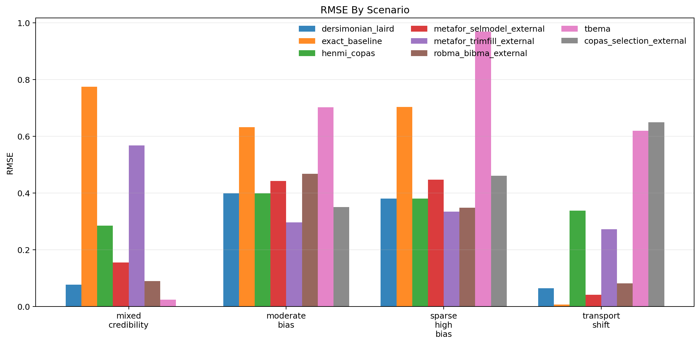
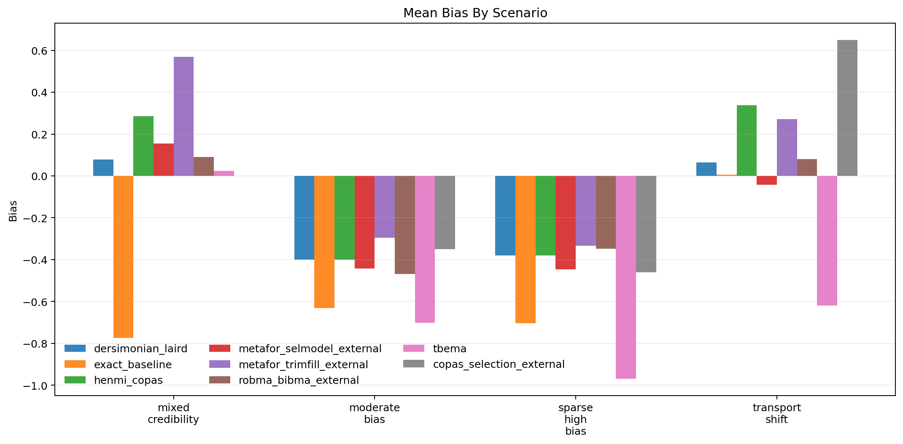
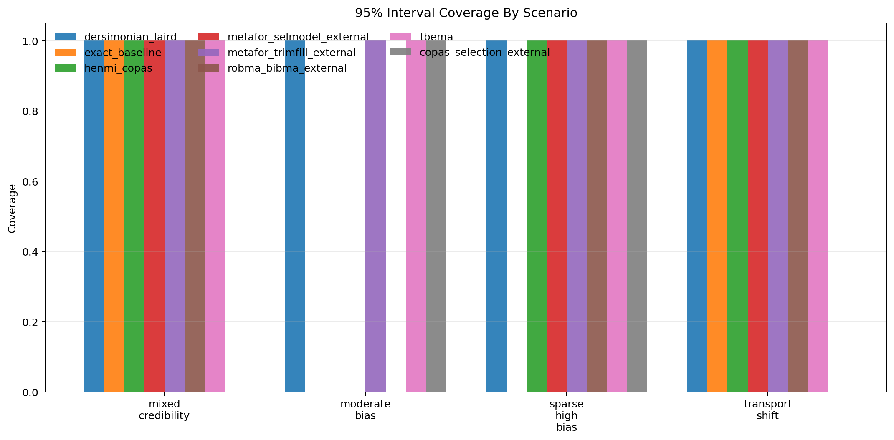
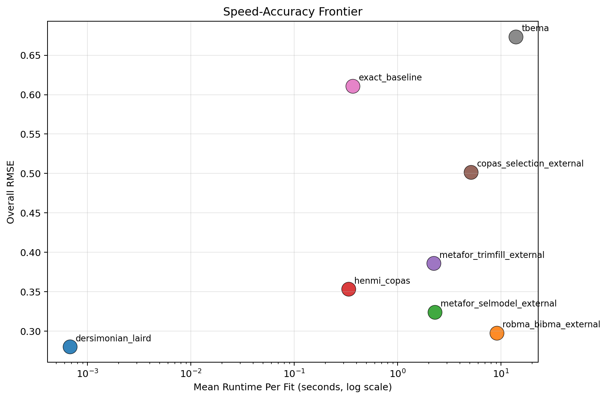

# MetaFrontierLab Benchmark Report

Generated: `2026-04-01T11:34:17.733115+00:00`

## Scope

- Replications per scenario: `1`
- Methods: `tbema, exact_baseline, dersimonian_laird, henmi_copas, metafor_trimfill_external, metafor_selmodel_external, copas_selection_external, robma_bibma_external`
- Scenarios: `4`

## Executive Summary

- Best overall RMSE in this run: `dersimonian_laird` with RMSE `0.280`.
- Fastest method in this run: `dersimonian_laird` at `0.001` seconds per fit on average.
- Interpret these results as engineering benchmarks, not publication-grade evidence, unless you scale the replication count much higher.

## Overall Method Ranking

| method | successful_runs | bias | mean_absolute_error | rmse | coverage_95 | mean_ci_width | mean_elapsed_sec |
| --- | --- | --- | --- | --- | --- | --- | --- |
| dersimonian_laird | 4 | -0.159 | 0.230 | 0.280 | 1.000 | 1.025 | 0.001 |
| robma_bibma_external | 4 | -0.161 | 0.247 | 0.298 | 0.750 | 0.976 | 9.125 |
| metafor_selmodel_external | 4 | -0.194 | 0.271 | 0.324 | 0.750 | 1.210 | 2.282 |
| henmi_copas | 4 | -0.039 | 0.351 | 0.353 | 0.750 | 1.127 | 0.334 |
| metafor_trimfill_external | 4 | 0.052 | 0.368 | 0.386 | 1.000 | 1.115 | 2.225 |
| copas_selection_external | 3 | -0.054 | 0.486 | 0.502 | 0.667 | 1.082 | 5.143 |
| exact_baseline | 4 | -0.526 | 0.529 | 0.611 | 0.500 | 1.243 | 0.369 |
| tbema | 4 | -0.567 | 0.578 | 0.674 | 1.000 | 3.785 | 13.922 |

## Scenario Highlights

- `mixed_credibility`: best RMSE was `tbema` (0.024); fastest was `dersimonian_laird` (0.001s); widest intervals came from `tbema` (4.685).
- `moderate_bias`: best RMSE was `metafor_trimfill_external` (0.296); fastest was `dersimonian_laird` (0.001s); widest intervals came from `tbema` (1.572).
- `sparse_high_bias`: best RMSE was `metafor_trimfill_external` (0.334); fastest was `dersimonian_laird` (0.001s); widest intervals came from `tbema` (5.560).
- `transport_shift`: best RMSE was `exact_baseline` (0.006); fastest was `dersimonian_laird` (0.001s); widest intervals came from `tbema` (3.324).

## Scenario Table

| scenario | method | successful_runs | bias | rmse | coverage_95 | mean_ci_width | mean_elapsed_sec |
| --- | --- | --- | --- | --- | --- | --- | --- |
| mixed_credibility | copas_selection_external | 0 | NA | NA | NA | NA | 5.705 |
| mixed_credibility | dersimonian_laird | 1 | 0.077 | 0.077 | 1.000 | 1.135 | 0.001 |
| mixed_credibility | exact_baseline | 1 | -0.774 | 0.774 | 1.000 | 1.990 | 0.559 |
| mixed_credibility | henmi_copas | 1 | 0.285 | 0.285 | 1.000 | 1.329 | 0.351 |
| mixed_credibility | metafor_selmodel_external | 1 | 0.155 | 0.155 | 1.000 | 1.548 | 2.285 |
| mixed_credibility | metafor_trimfill_external | 1 | 0.568 | 0.568 | 1.000 | 1.345 | 2.380 |
| mixed_credibility | robma_bibma_external | 1 | 0.090 | 0.090 | 1.000 | 1.077 | 9.757 |
| mixed_credibility | tbema | 1 | 0.024 | 0.024 | 1.000 | 4.685 | 18.506 |
| moderate_bias | copas_selection_external | 1 | -0.351 | 0.351 | 1.000 | 0.893 | 5.242 |
| moderate_bias | dersimonian_laird | 1 | -0.399 | 0.399 | 1.000 | 0.824 | 0.001 |
| moderate_bias | exact_baseline | 1 | -0.632 | 0.632 | 0.000 | 0.827 | 0.221 |
| moderate_bias | henmi_copas | 1 | -0.399 | 0.399 | 0.000 | 0.765 | 0.312 |
| moderate_bias | metafor_selmodel_external | 1 | -0.442 | 0.442 | 0.000 | 0.870 | 2.434 |
| moderate_bias | metafor_trimfill_external | 1 | -0.296 | 0.296 | 1.000 | 0.871 | 2.198 |
| moderate_bias | robma_bibma_external | 1 | -0.468 | 0.468 | 0.000 | 0.836 | 9.571 |
| moderate_bias | tbema | 1 | -0.703 | 0.703 | 1.000 | 1.572 | 7.745 |
| sparse_high_bias | copas_selection_external | 1 | -0.460 | 0.460 | 1.000 | 1.254 | 4.810 |
| sparse_high_bias | dersimonian_laird | 1 | -0.380 | 0.380 | 1.000 | 1.148 | 0.001 |
| sparse_high_bias | exact_baseline | 1 | -0.704 | 0.704 | 0.000 | 1.232 | 0.219 |
| sparse_high_bias | henmi_copas | 1 | -0.380 | 0.380 | 1.000 | 1.076 | 0.245 |
| sparse_high_bias | metafor_selmodel_external | 1 | -0.447 | 0.447 | 1.000 | 1.272 | 2.203 |
| sparse_high_bias | metafor_trimfill_external | 1 | -0.334 | 0.334 | 1.000 | 1.202 | 2.100 |
| sparse_high_bias | robma_bibma_external | 1 | -0.348 | 0.348 | 1.000 | 1.067 | 8.529 |
| sparse_high_bias | tbema | 1 | -0.968 | 0.968 | 1.000 | 5.560 | 16.850 |
| transport_shift | copas_selection_external | 1 | 0.649 | 0.649 | 0.000 | 1.099 | 5.377 |
| transport_shift | dersimonian_laird | 1 | 0.064 | 0.064 | 1.000 | 0.993 | 0.001 |
| transport_shift | exact_baseline | 1 | 0.006 | 0.006 | 1.000 | 0.925 | 0.478 |
| transport_shift | henmi_copas | 1 | 0.338 | 0.338 | 1.000 | 1.339 | 0.429 |
| transport_shift | metafor_selmodel_external | 1 | -0.042 | 0.042 | 1.000 | 1.149 | 2.207 |
| transport_shift | metafor_trimfill_external | 1 | 0.272 | 0.272 | 1.000 | 1.045 | 2.221 |
| transport_shift | robma_bibma_external | 1 | 0.081 | 0.081 | 1.000 | 0.924 | 8.644 |
| transport_shift | tbema | 1 | -0.619 | 0.619 | 1.000 | 3.324 | 12.585 |

## Figures

### RMSE

### Bias

### Coverage

### Speed-Accuracy Frontier

## Reproducibility

- Source run table: `results/benchmarks_tuned_smoke/benchmark_runs.csv`
- Source summary table: `results/benchmarks_tuned_smoke/benchmark_summary.csv`
- Source metadata: `results/benchmarks_tuned_smoke/benchmark_metadata.json`
