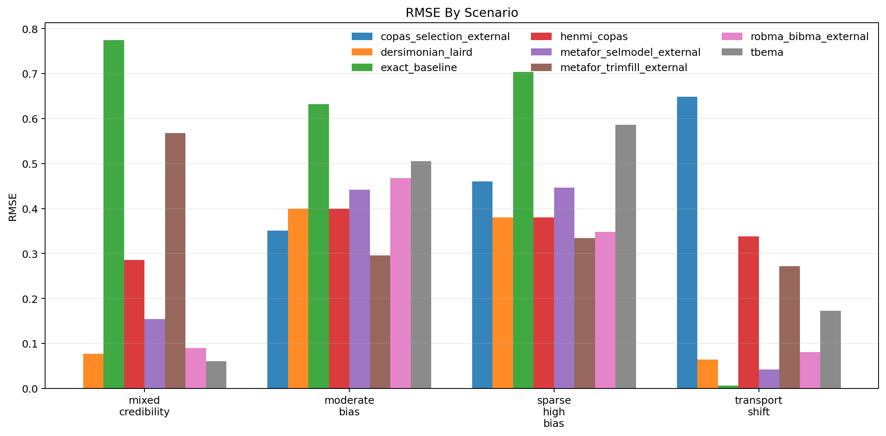
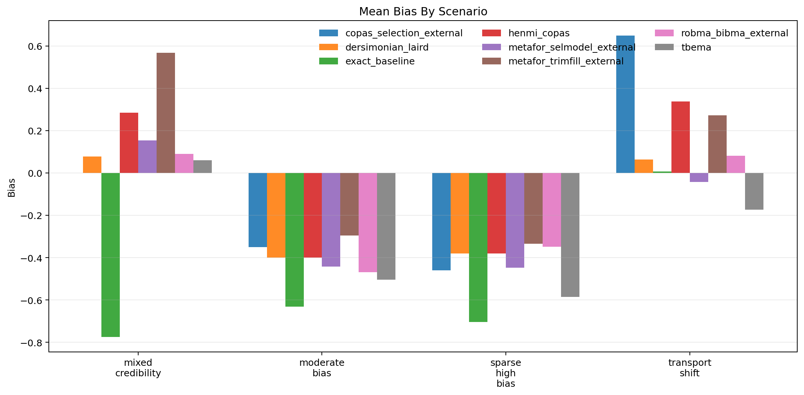
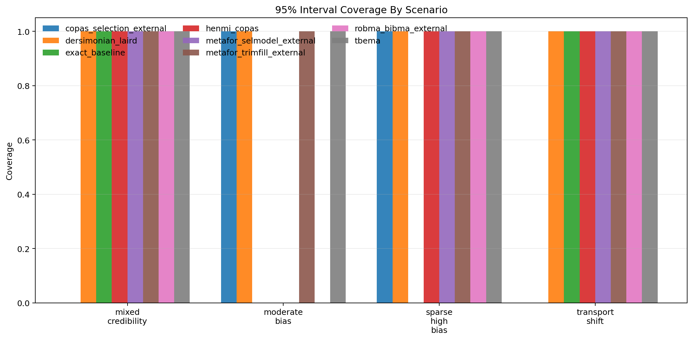
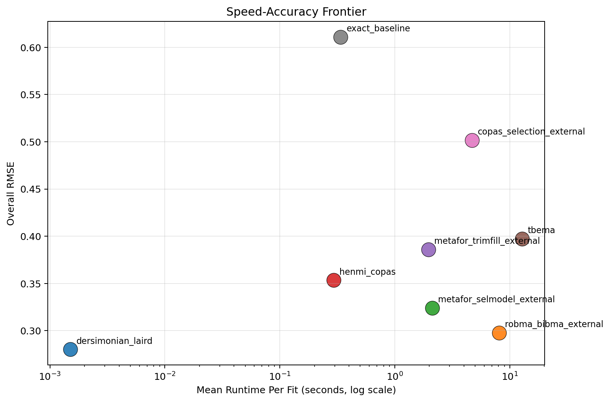

# MetaFrontierLab Benchmark Report

Generated: `2026-04-01T11:37:30.416130+00:00`

## Scope

- Replications per scenario: `1`
- Methods: `tbema, exact_baseline, dersimonian_laird, henmi_copas, metafor_trimfill_external, metafor_selmodel_external, copas_selection_external, robma_bibma_external`
- Scenarios: `4`

## Executive Summary

- Best overall RMSE in this run: `dersimonian_laird` with RMSE `0.280`.
- Fastest method in this run: `dersimonian_laird` at `0.002` seconds per fit on average.
- Interpret these results as engineering benchmarks, not publication-grade evidence, unless you scale the replication count much higher.

## Overall Method Ranking

| method | successful_runs | bias | mean_absolute_error | rmse | coverage_95 | mean_ci_width | mean_elapsed_sec |
| --- | --- | --- | --- | --- | --- | --- | --- |
| dersimonian_laird | 4 | -0.159 | 0.230 | 0.280 | 1.000 | 1.025 | 0.002 |
| robma_bibma_external | 4 | -0.161 | 0.247 | 0.298 | 0.750 | 0.976 | 8.103 |
| metafor_selmodel_external | 4 | -0.194 | 0.271 | 0.324 | 0.750 | 1.210 | 2.113 |
| henmi_copas | 4 | -0.039 | 0.351 | 0.353 | 0.750 | 1.127 | 0.294 |
| metafor_trimfill_external | 4 | 0.052 | 0.368 | 0.386 | 1.000 | 1.115 | 1.962 |
| tbema | 4 | -0.301 | 0.331 | 0.397 | 1.000 | 2.604 | 12.786 |
| copas_selection_external | 4 | -0.054 | 0.486 | 0.502 | 0.500 | 1.082 | 4.705 |
| exact_baseline | 4 | -0.526 | 0.529 | 0.611 | 0.500 | 1.243 | 0.339 |

## Scenario Highlights

- `mixed_credibility`: best RMSE was `tbema` (0.060); fastest was `dersimonian_laird` (0.001s); widest intervals came from `tbema` (2.982).
- `moderate_bias`: best RMSE was `metafor_trimfill_external` (0.296); fastest was `dersimonian_laird` (0.004s); widest intervals came from `tbema` (1.244).
- `sparse_high_bias`: best RMSE was `metafor_trimfill_external` (0.334); fastest was `dersimonian_laird` (0.001s); widest intervals came from `tbema` (3.487).
- `transport_shift`: best RMSE was `exact_baseline` (0.006); fastest was `dersimonian_laird` (0.001s); widest intervals came from `tbema` (2.701).

## Scenario Table

| scenario | method | successful_runs | bias | rmse | coverage_95 | mean_ci_width | mean_elapsed_sec |
| --- | --- | --- | --- | --- | --- | --- | --- |
| mixed_credibility | copas_selection_external | 1 | NA | NA | 0.000 | NA | 4.789 |
| mixed_credibility | dersimonian_laird | 1 | 0.077 | 0.077 | 1.000 | 1.135 | 0.001 |
| mixed_credibility | exact_baseline | 1 | -0.774 | 0.774 | 1.000 | 1.990 | 0.584 |
| mixed_credibility | henmi_copas | 1 | 0.285 | 0.285 | 1.000 | 1.329 | 0.354 |
| mixed_credibility | metafor_selmodel_external | 1 | 0.155 | 0.155 | 1.000 | 1.548 | 2.088 |
| mixed_credibility | metafor_trimfill_external | 1 | 0.568 | 0.568 | 1.000 | 1.345 | 2.037 |
| mixed_credibility | robma_bibma_external | 1 | 0.090 | 0.090 | 1.000 | 1.077 | 8.163 |
| mixed_credibility | tbema | 1 | 0.060 | 0.060 | 1.000 | 2.982 | 17.188 |
| moderate_bias | copas_selection_external | 1 | -0.351 | 0.351 | 1.000 | 0.893 | 4.647 |
| moderate_bias | dersimonian_laird | 1 | -0.399 | 0.399 | 1.000 | 0.824 | 0.004 |
| moderate_bias | exact_baseline | 1 | -0.632 | 0.632 | 0.000 | 0.827 | 0.196 |
| moderate_bias | henmi_copas | 1 | -0.399 | 0.399 | 0.000 | 0.765 | 0.262 |
| moderate_bias | metafor_selmodel_external | 1 | -0.442 | 0.442 | 0.000 | 0.870 | 2.235 |
| moderate_bias | metafor_trimfill_external | 1 | -0.296 | 0.296 | 1.000 | 0.871 | 1.950 |
| moderate_bias | robma_bibma_external | 1 | -0.468 | 0.468 | 0.000 | 0.836 | 8.183 |
| moderate_bias | tbema | 1 | -0.505 | 0.505 | 1.000 | 1.244 | 6.921 |
| sparse_high_bias | copas_selection_external | 1 | -0.460 | 0.460 | 1.000 | 1.254 | 4.612 |
| sparse_high_bias | dersimonian_laird | 1 | -0.380 | 0.380 | 1.000 | 1.148 | 0.001 |
| sparse_high_bias | exact_baseline | 1 | -0.704 | 0.704 | 0.000 | 1.232 | 0.207 |
| sparse_high_bias | henmi_copas | 1 | -0.380 | 0.380 | 1.000 | 1.076 | 0.222 |
| sparse_high_bias | metafor_selmodel_external | 1 | -0.447 | 0.447 | 1.000 | 1.272 | 1.968 |
| sparse_high_bias | metafor_trimfill_external | 1 | -0.334 | 0.334 | 1.000 | 1.202 | 1.941 |
| sparse_high_bias | robma_bibma_external | 1 | -0.348 | 0.348 | 1.000 | 1.067 | 7.882 |
| sparse_high_bias | tbema | 1 | -0.586 | 0.586 | 1.000 | 3.487 | 16.214 |
| transport_shift | copas_selection_external | 1 | 0.649 | 0.649 | 0.000 | 1.099 | 4.771 |
| transport_shift | dersimonian_laird | 1 | 0.064 | 0.064 | 1.000 | 0.993 | 0.001 |
| transport_shift | exact_baseline | 1 | 0.006 | 0.006 | 1.000 | 0.925 | 0.369 |
| transport_shift | henmi_copas | 1 | 0.338 | 0.338 | 1.000 | 1.339 | 0.337 |
| transport_shift | metafor_selmodel_external | 1 | -0.042 | 0.042 | 1.000 | 1.149 | 2.159 |
| transport_shift | metafor_trimfill_external | 1 | 0.272 | 0.272 | 1.000 | 1.045 | 1.922 |
| transport_shift | robma_bibma_external | 1 | 0.081 | 0.081 | 1.000 | 0.924 | 8.181 |
| transport_shift | tbema | 1 | -0.173 | 0.173 | 1.000 | 2.701 | 10.820 |

## Figures

### RMSE

### Bias

### Coverage

### Speed-Accuracy Frontier

## Reproducibility

- Source run table: `results/benchmarks_tuned_smoke2/benchmark_runs.csv`
- Source summary table: `results/benchmarks_tuned_smoke2/benchmark_summary.csv`
- Source metadata: `results/benchmarks_tuned_smoke2/benchmark_metadata.json`
