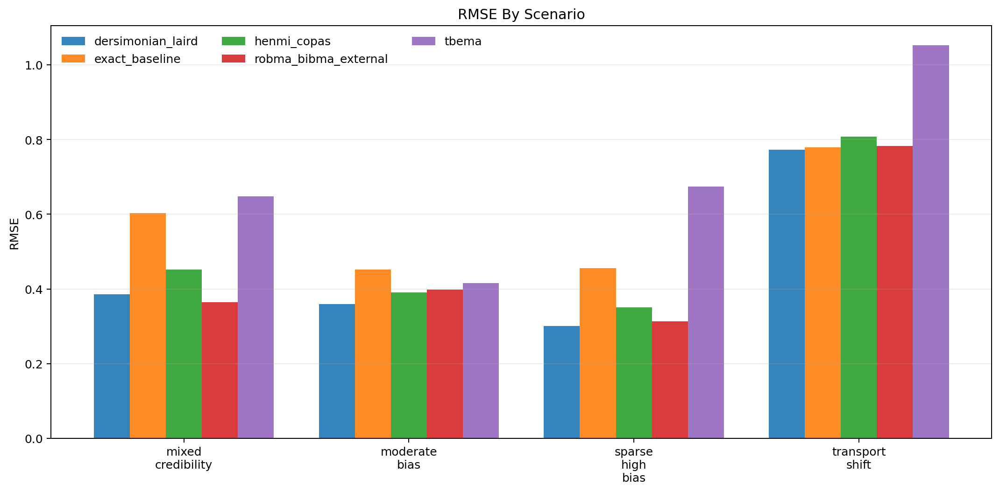
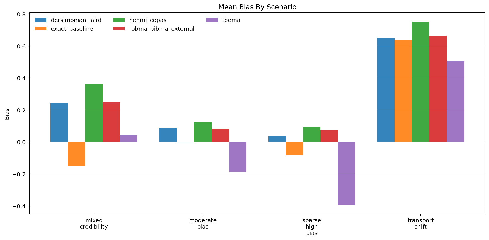
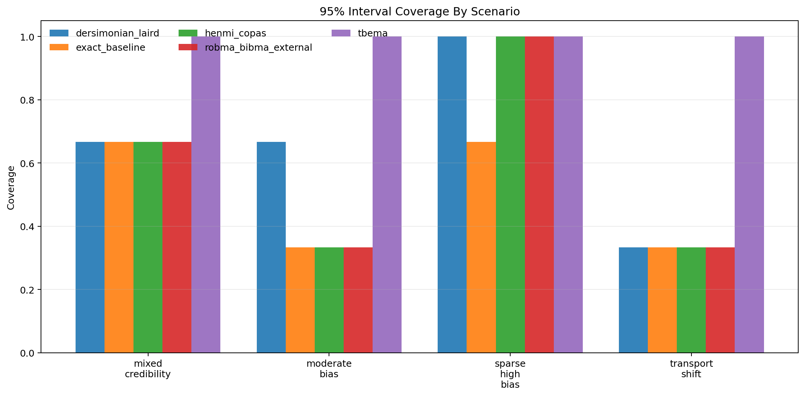
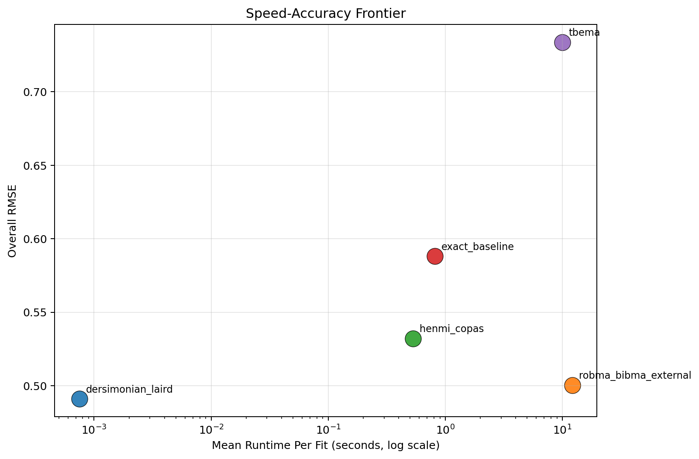

# MetaFrontierLab Benchmark Report

Generated: `2026-04-01T11:08:07.316582+00:00`

## Scope

- Replications per scenario: `3`
- Methods: `tbema, exact_baseline, dersimonian_laird, henmi_copas, robma_bibma_external`
- Scenarios: `4`

## Executive Summary

- Best overall RMSE in this run: `dersimonian_laird` with RMSE `0.491`.
- Fastest method in this run: `dersimonian_laird` at `0.001` seconds per fit on average.
- Interpret these results as engineering benchmarks, not publication-grade evidence, unless you scale the replication count much higher.

## Overall Method Ranking

| method | successful_runs | bias | mean_absolute_error | rmse | coverage_95 | mean_ci_width | mean_elapsed_sec |
| --- | --- | --- | --- | --- | --- | --- | --- |
| dersimonian_laird | 12 | 0.254 | 0.385 | 0.491 | 0.667 | 0.871 | 0.001 |
| robma_bibma_external | 12 | 0.267 | 0.403 | 0.500 | 0.583 | 0.814 | 12.169 |
| henmi_copas | 12 | 0.334 | 0.464 | 0.532 | 0.583 | 0.992 | 0.530 |
| exact_baseline | 12 | 0.100 | 0.503 | 0.588 | 0.500 | 1.043 | 0.815 |
| tbema | 12 | -0.009 | 0.546 | 0.734 | 1.000 | 4.805 | 9.997 |

## Scenario Highlights

- `mixed_credibility`: best RMSE was `robma_bibma_external` (0.364); fastest was `dersimonian_laird` (0.001s); widest intervals came from `tbema` (3.336).
- `moderate_bias`: best RMSE was `dersimonian_laird` (0.359); fastest was `dersimonian_laird` (0.001s); widest intervals came from `tbema` (2.703).
- `sparse_high_bias`: best RMSE was `dersimonian_laird` (0.301); fastest was `dersimonian_laird` (0.001s); widest intervals came from `tbema` (6.024).
- `transport_shift`: best RMSE was `dersimonian_laird` (0.772); fastest was `dersimonian_laird` (0.001s); widest intervals came from `tbema` (7.157).

## Scenario Table

| scenario | method | successful_runs | bias | rmse | coverage_95 | mean_ci_width | mean_elapsed_sec |
| --- | --- | --- | --- | --- | --- | --- | --- |
| mixed_credibility | dersimonian_laird | 3 | 0.245 | 0.385 | 0.667 | 0.996 | 0.001 |
| mixed_credibility | exact_baseline | 3 | -0.149 | 0.603 | 0.667 | 1.359 | 0.983 |
| mixed_credibility | henmi_copas | 3 | 0.365 | 0.452 | 0.667 | 1.201 | 0.661 |
| mixed_credibility | robma_bibma_external | 3 | 0.248 | 0.364 | 0.667 | 0.913 | 13.260 |
| mixed_credibility | tbema | 3 | 0.042 | 0.648 | 1.000 | 3.336 | 10.293 |
| moderate_bias | dersimonian_laird | 3 | 0.086 | 0.359 | 0.667 | 0.742 | 0.001 |
| moderate_bias | exact_baseline | 3 | -0.003 | 0.452 | 0.333 | 0.887 | 1.023 |
| moderate_bias | henmi_copas | 3 | 0.124 | 0.391 | 0.333 | 0.775 | 0.487 |
| moderate_bias | robma_bibma_external | 3 | 0.081 | 0.398 | 0.333 | 0.703 | 11.875 |
| moderate_bias | tbema | 3 | -0.187 | 0.416 | 1.000 | 2.703 | 9.000 |
| sparse_high_bias | dersimonian_laird | 3 | 0.034 | 0.301 | 1.000 | 1.047 | 0.001 |
| sparse_high_bias | exact_baseline | 3 | -0.084 | 0.456 | 0.667 | 1.175 | 0.675 |
| sparse_high_bias | henmi_copas | 3 | 0.094 | 0.351 | 1.000 | 1.132 | 0.488 |
| sparse_high_bias | robma_bibma_external | 3 | 0.073 | 0.313 | 1.000 | 0.924 | 11.650 |
| sparse_high_bias | tbema | 3 | -0.392 | 0.674 | 1.000 | 6.024 | 9.332 |
| transport_shift | dersimonian_laird | 3 | 0.650 | 0.772 | 0.333 | 0.699 | 0.001 |
| transport_shift | exact_baseline | 3 | 0.637 | 0.779 | 0.333 | 0.749 | 0.577 |
| transport_shift | henmi_copas | 3 | 0.752 | 0.808 | 0.333 | 0.859 | 0.483 |
| transport_shift | robma_bibma_external | 3 | 0.664 | 0.783 | 0.333 | 0.715 | 11.893 |
| transport_shift | tbema | 3 | 0.503 | 1.052 | 1.000 | 7.157 | 11.362 |

## Figures

### RMSE

### Bias

### Coverage

### Speed-Accuracy Frontier

## Reproducibility

- Source run table: `results/benchmarks_with_robma/benchmark_runs.csv`
- Source summary table: `results/benchmarks_with_robma/benchmark_summary.csv`
- Source metadata: `results/benchmarks_with_robma/benchmark_metadata.json`
